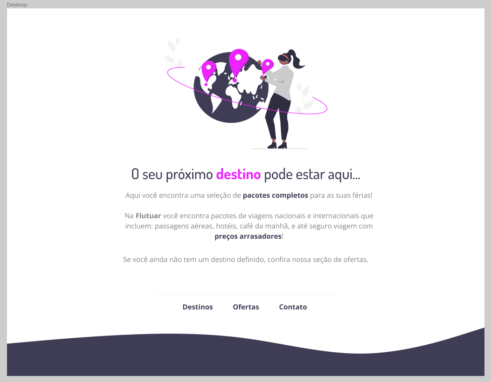

# desafio-explore-projeto01-extra
Desafio intermediário - Recriando layout

# 💻 Sobre o desafio

Nesse desafio, você deverá recriar uma aplicação, a partir de um layout pronto no Figma, para fortalecer alguns conceitos aprendidos nessa aula, entre eles:

- Estruturando um projeto HTML;
- Uso de tags HTML mais comuns;
- Conceitos iniciais de CSS;
- Posicionamento e alinhamento de elementos na tela;
- Aplicando fontes customizadas;
- Espaçamentos.

## Layout da aplicação

O Figma está disponível nesse **[link](https://www.figma.com/file/waisYRoNzeBgIxOyrz0b2R/Projeto01-Extra/duplicate).** Abaixo você consegue visualizar a carinha da aplicação:
